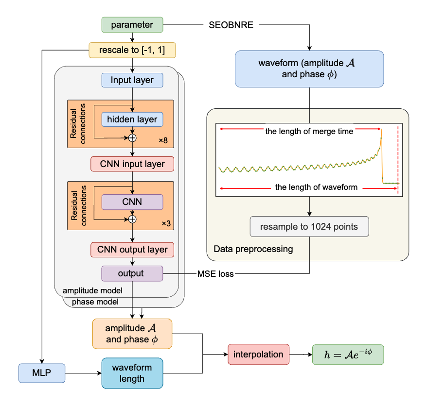

# SEOBNRE-AI Waveform Generator

This repository provides a deep learning-based surrogate model for generating gravitational waveforms. The model is trained to emulate the SEOBNRE waveform model for binary black hole systems under specific parameter ranges.



## Features

- **AI-based SEOBNRE waveform generator**  
  This tool generates waveforms ( $(2,2)$ mode) for binary black holes with:
  - **Total mass** fixed at 60 solar masses
  - **Mass ratio** \( q \) in the range \([1, 5]\)
  - **Eccentricity** \( e \) in the range \([0, 0.2]\)
  - **Dimensionless spin** \( \chi \) in the range \([-0.6, 0.6]\)

## Installation

Make sure you have [PyTorch](https://pytorch.org/) installed in your environment. You can install it with:

```bash
pip install torch
```

## Training

To train the model, navigate to the `model` directory and run:

```bash
cd model
bash ./src_train/par_wave_interpolation_5par_amp_samll_len.sh
```

This will start training the model using the preconfigured script.

## Inference Demo

After training, the trained model checkpoints will be saved in the `check_point` folder. You can run the waveform generation demo with the provided notebook:

```bash
check_point/example.ipynb
```

This notebook demonstrates how to load the trained model and generate waveforms for arbitrary input parameters within the specified range.

## Related Publication

This repository is based on the paper:

**Rapid eccentric spin-aligned binary black hole waveform generation based on deep learning**  
Ruijun Shi, Yue Zhou, Tianyu Zhao, et al.

**Abstract:**  
Accurate waveform templates of binary black holes (BBHs) with eccentric orbits are essential for the detection and precise parameter estimation of gravitational waves (GWs).
While SEOBNRE produces accurate time-domain waveforms for eccentric BBH systems, its generation speed remains a critical bottleneck in analyzing such systems. 
Accelerating template generation is crucial to data analysis improvement and valuable information extraction from observational data.
We present SEOBNRE\_AIq5e2, an innovative AI-based surrogate model that crafted to accelerate waveform generation for eccentric, spin-aligned BBH systems. %, revolutionizing the efficiency of SEOBNRE waveforms.
SEOBNRE\_AIq5e2 incorporates an advanced adaptive resampling technique during training, enabling the generation of eccentric BBH waveforms with mass ratios up to 5, eccentricities below 0.2, and spins $|\chi_z|$ up to 0.6. 
It achieves an impressive generation speed of 4.3 ms per waveform with a mean mismatch of $1.02 \times 10^{-3}$. 
With the exceptional accuracy and rapid performance, {SEOBNRE\_AIq5e2} emerges as a promising waveform template for future analysis of eccentric gravitational wave data.

**[Link to the paper](https://journals.aps.org/prd/abstract/10.1103/PhysRevD.111.044016)**


## Citation
If you use this work in your research, please cite the following paper:

```bibtex
@article{PhysRevD.111.044016,
  title = {Rapid eccentric spin-aligned binary black hole waveform generation based on deep learning},
  author = {Shi, Ruijun and Zhou, Yue and Zhao, Tianyu and Wang, Zun and Ren, Zhixiang and Cao, Zhoujian},
  journal = {Phys. Rev. D},
  volume = {111},
  issue = {4},
  pages = {044016},
  numpages = {13},
  year = {2025},
  month = {Feb},
  publisher = {American Physical Society},
  doi = {10.1103/PhysRevD.111.044016},
  url = {https://link.aps.org/doi/10.1103/PhysRevD.111.044016}
}

```

